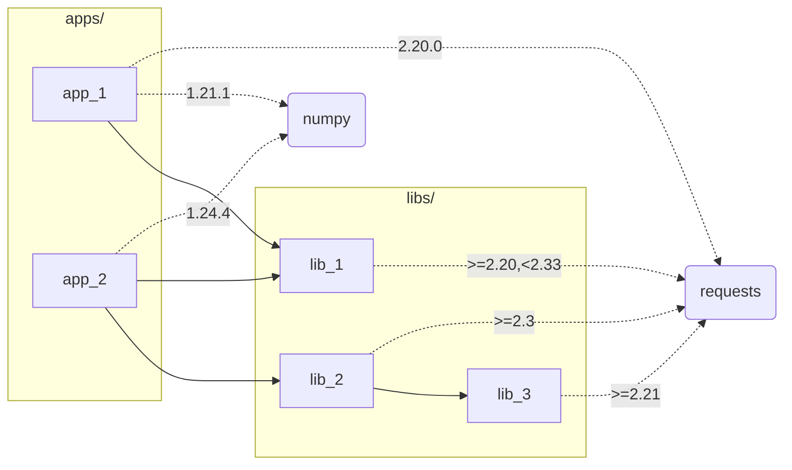

# pants-by-source-resolve

This Repo is an example for how to use Pants for a Monorepo that has standalone apps with shared libs  
The repo assumes the following:
- apps do not import each other
- apps can import libs
- libs can import libs

The repo is using both `[python-infer].ambiguity_resolution = "by_source_root"` and `[python].enable_resolves = true` in order to manage dependencies  

### Visualization


### Running
app_1:
```
pants run python/apps/app_1/run.py

# expected output:

Hello, app_1!
requests version: 2.20.0
python 3.7.17 (default, Jul 21 2024, 16:26:57) 
[Clang 15.0.0 (clang-1500.3.9.4)]
numpy version: 1.21.1
requests version: 2.20.0
```
app_2:
```
pants run python/apps/app_2/run.py

# expected output:

Hello, app_2 lib1!
requests version: 2.32.3
Hello, app_2 lib2!
requests version: 2.32.3
requests version: 2.32.3
python 3.8.19 (default, Jul 21 2024, 16:31:04) 
[Clang 15.0.0 (clang-1500.3.9.4)]
numpy version: 1.24.4
```
lib_1 with app_1 resolve:
```
pants run python/libs/lib_1/examples/saying_hello.py:../lib_1@parametrize=app_1

# expected output

running example - saying hello
Hello, Omer!
requests version: 2.20.0
```
lib_1 with app_2 resolve:
```
pants run python/libs/lib_1/examples/saying_hello.py:../lib_1@parametrize=app_2

# expected output

running example - saying hello
Hello, Omer!
requests version: 2.32.3
```
